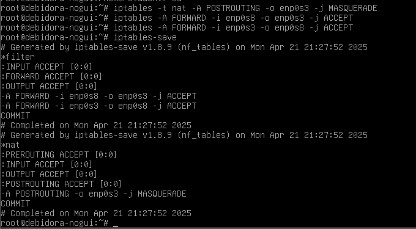

# DNS and IP Forwarding

## Topology


Pada topologi di atas, VM 1 bertugas sebagai gateway yang akan menghuubungkan VM 2 ke internet dengan ip forwarding, selain itu pada VM 1 juga akan dikonfigurasi sebagai DNS server untuk nameserver `www.kelompok9.com.`

Dan untuk VM 2 akan berperan sebagai client jaringan di atas

## VM 1 Configurations

### [1] Install requirements

Pertama, install `bind9` untuk DNS server, dan `iptables` untuk Routing tables dengan perintah berikut

```bash
sudo apt install bind9 bind9utils
```


disini `bind9utils` nantinya akan digunakan untuk mengecek hasil konfigurasi zones

```bash
sudo apt install iptables iptables-persistent
```


untuk `iptables-persistent` diinstall agar rules yang dibuat dapat tersimpan meski VM dimatikan, sehingga tidak perlu mengonfigurasi ulang nantinya

### [2] Set IP Addresses

untuk mengonfigurasi ip address pada VM 1, kita bisa mengedit file `/etc/network/interfaces`

```bash
sudo nano /etc/network/interfaces
```


Disini `enp0s3` adalah network interface primary yang kita hubungkan ke bridge adapter / internet, sedangakn untuk `enp0s8` adalah interface secondary yang terhubung ke internal network yang nantinya akan dihubungkan ke VM 2

Untuk itu, konfigurasi `enp0s3` akan kita biarkan default untuk menerima ip address sebagai DHCP client
Sedangkan untuk konfigurasi `enp0s8` akan kita beri IP static `192.168.200.1` dengan netmask `255.255.255.0` atau /24

setelah mengonfigurasi file tersebut, restart network agar perubahan pada `/etc/network/interfaces` dapat diterapkan

```bash
sudo systemctl restart networking
```

Dan kita dapat mengecek apakah ip address sudah berubah sesuai konfigurasi kita dengan perintah `ip a`

### [3] DNS Configuration

Pertama, masuk ke direktori `/etc/bind` kemudian kita akan mengonfigurasi beberapa file, pertama kita akan mengonfigurasi file `named.conf`

```bash
sudo nano named.conf
```


tambahkan line `include "/etc/bind/named.conf.external-zones"` untuk menambahkan zones yang nantinya akan kita buat

Kemudian konfigurasi file `named.conf.options`

```bash
sudo nano named.conf.options
```


Tambahkan beberapa line berikut

```bash
allow-query { any; };
allow-transfer { any; };
recursion yes;
```

Selanjutnya adalah file `named.conf.external-zones`

```bash
sudo nano named.conf.external-zones
```


disini kita akan membuat zones untuk DNS kita, kita membuat 2 zones dimana satu untuk nameserver yaitu `kelompok2.com` dan satu lagi untuk IP nya `1.200.168.192.in-addr.arpa`
pada line `file` berikan lokasi file untuk konfigurasi zone nantinya

Untuk konfigurasi zones, pertama saya akan mengonfigurasi file `kelompok2.com`

```bash
sudo nano kelompok2.com
```


selanjutnya file `1.200.168.192.db`

```bash
sudo nano 1.200.168.192.db
```


setelah membuat konfigurasi untuk kedua zones tersebut, kita dapat mengecek apakah ada kesalahan dalam konfigurasi menggunakan perintah `named-checkzone` dari `bind9utils`

```bash
named-checkzone [nama_zone] [file_konfigurasi_zone]
```


dan diatas sudah memampilkan `OK` untuk kedua zone yang berarti tidak ada masalah yang ditemukan

setelah semua konfigurasi di atas, restart `named.service` untuk menerapkan semua konfigurasi tersebut

```bash
sudo systemctl restart named
```

### [4] Set IP Forwarding

Pertama, ubah nilai ip_forward menjadi 1 agar VM 1 dapat meneruskan IP dengan perintah berikut:

```bash
echo 1 > /proc/sys/net/ipv4/ip_forward
```


jika file tersebut ditampilkan dengan perintah `cat` dan menampilkan nilai 1, maka ip_forward sudah diaktifkan

Selanjutnya adalah konfigurasi `iptables`, jalankan perintah berikut:

```bash
sudo iptables -t nat -A POSTROUTING -o enp0s3 -j MASQUERADE
```

Perintah tersebut digunakan untuk menambahkan tabel NAT pada `iptables` dan melakukan `MASQUERADE` ke ip yang diteruskan ke interface `enp0s3` yang terhubung ke Internet
Perintah ini berfungsi untuk mentranslasikan ip private ke ip public ke internet 

Selanjutnya jalankan perintah berikut:

```bash
sudo iptables -A FORWARD -i enp0s8 -o enp0s3 -j ACCEPT
sudo iptables -A FORWARD -i enp0s3 -o enp0s8 -j ACCEPT
```

Perintah ini akan menambahkan rules untuk meneruskan ip dari interface `enp0s8` ke `enp0s3` dan sebaliknya agar nantinya VM 2 bisa terhubung ke Internet



setelah menambahkan tabel NAT dan rules di atas, untuk menyimpan konfigurasi tersebut, jalankan perintah berikut:

```bash
sudo iptables-save
```


## VM 2 Configurations

Selanjutnya kita akan mengonfigurasi untuk VM 2 sebagai Client

KIta hanya perlu mengonfigurasi IP Static dari VM 2, dengan masuk Ke Wired Settings dan masuk Ke Tab IPv4 dan isikan address yang berada pada satu network dengan IP Address pada interface `enp0s8` pada VM 1 sebelumnya, yaitu `192.168.200.x` sebagai berikut:


Masukkan juga IP Address 192.168.200.1 pada DNS agar kita dapat terhubung dengan DNS pada VM 1

Untuk mengonfigurasi IP pada VM 2 juga bisa dilakukan melalui CLI seperti pada VM 1 jika menggunakan OS tanpa GUI

### ping to VM 1

Disini akan dicoba untuk melakukan ping ke IP addresss dari VM 1 untuk mengecek koneksi antara VM 2 dan VM 1


dan disini sudah ditampilkan bahwa VM 1 dan VM 2 sudah bisa saling berkomunikasi

### check internet

Disini saya mencoba untuk membuka halaman web untuk mengecek apakah VM 2 sudah bisa terhubung dengan internet


dan saya sudah bisa mengakses internet pada VM 1

### check VM 1 DNS

Disini saya mencoba DNS yang sudah dikonfigurasi pada VM 1 sebelumnya pada VM 2 dengan menggunakan `dig` / `nslookup`


dan dapat kita lihat bahwa pada output `dig` sudah menampilkan ANSWER SECTION dan pada output `nslookup` juga sudah menampilkan nameserver dan ip addressnya
