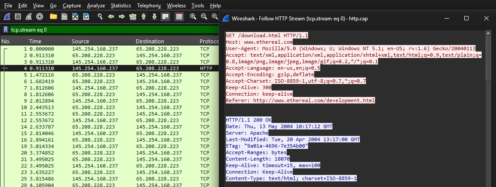
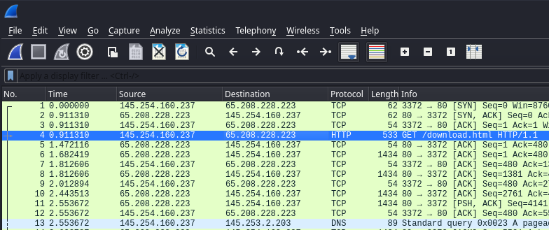
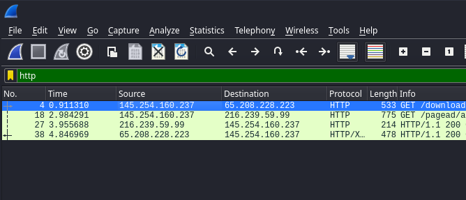
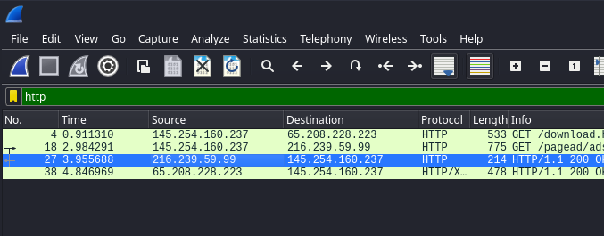
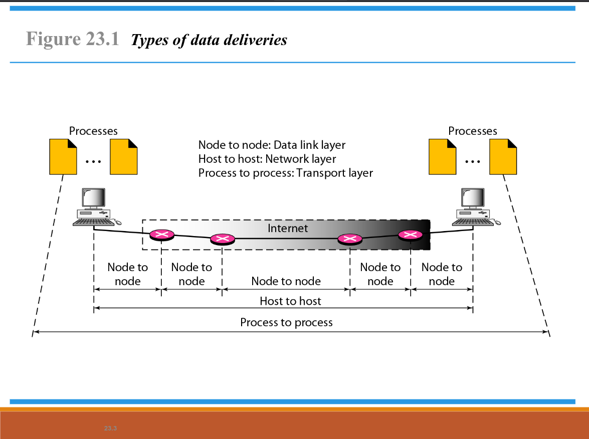
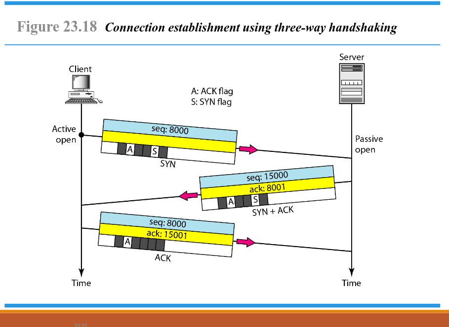
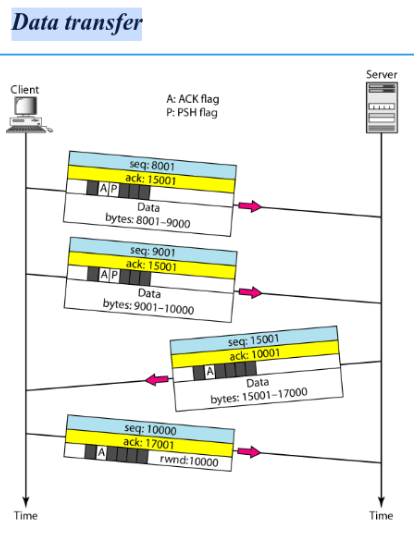

 # Tugas Review ADMIN JARINGAN

**Nama** : Vemas Satria Edy Pratama 
**Kelas** :2 D4 IT A / 3123600020 

## Tugas1. Analisa File http.cap dengan Wireshark

### 1. Versi HTTP yang Digunakan

- Berdasarkan gambar di atas, versi HTTP yang digunakan adalah **HTTP/1.1**.
- Untuk mengetahui versi HTTP melalui Wireshark, pilih paket nomor 4, klik kanan dan pilih opsi **Follow** > **HTTP streams**. Versi HTTP dapat dilihat pada bagian client dan server di bagian paling atas.

### 2. IP Address dari Client maupun Server

- Berdasarkan gambar di atas, dapat diketahui bahwa *IP Address* dari client dan server adalah **145.254.160.237.** dan **65.208.228.223**. Untuk mengetahui **IP Address** dari client dan server dapat dilihat pada bagian **Source** dan **Destination**.

### 3. waktu dari client mengirimkan HTTP request

- Pada gambar di atas, untuk mengetahui waktu dari client mengirimkan HTTP request dapat dilihat pada **packet nomor 4** dengan waktu **0.911310**.

### 4. Waktu dari server mengirinmkan server dan berapa durasinya

- Pada gambar di atas, dapat diketahui waktu server mengirimkan ke client adalah **3.955688** dengan melihat **packet nomor 27**, sehingga dapat diketahui waktu selisih server mengirimkan data client.

- Selisih waktu :
  `Selisih waktu = 3.955688 - 0.911310 = 3.044378`

- Dengan demikian, selisih waktu server mengirimkan ke client adalah **3.044378**.

## Tugas2. Deskripsi Gambar pada Slide

Pada gambar di atas dapat dijelaskan bahwa:

1. **Node to Node (Data Link Layer)** 
  Pada tahap ini, komunikasi data terjadi antara dua perangkat fisik yang terhubung langsung dalam jaringan lokal (LAN). Data ditransmisikan dari satu node ke node lainnya melalui kabel atau koneksi nirkabel. Protokol yang bekerja pada lapisan ini meliputi Ethernet dan Wi-Fi. 
   - Fungsi utama: 
      - Mengatur bagaimana data dikirim dalam satu jaringan fisik. 
      - Menggunakan alamat MAC untuk mengidentifikasi perangkat. 
      - Menyediakan deteksi dan koreksi kesalahan pada transmisi data. 

2. **Host to Host (Network Layer)** 
  Ketika data perlu dikirim melampaui jaringan lokal, proses komunikasi antar host terjadi pada Network Layer. Protokol IP (Internet Protocol) digunakan untuk mengidentifikasi setiap perangkat yang terhubung dalam jaringan global. 
   - Fungsi utama: 
      - Menyediakan mekanisme routing agar paket data dapat mencapai tujuan akhir 
      - Menggunakan alamat IP sebagai identitas unik setiap perangkat. 
      - Menerapkan fragmentasi paket jika data terlalu besar untuk satu transmisi. 
  
  Proses ini melibatkan router yang meneruskan paket data dari satu jaringan ke jaringan lainnya. Setiap kali paket data berpindah dari satu router ke router lainnya, disebut sebagai Node to Node Communication. 

3. **Process to Process (Transport Layer)** 
   Setelah data mencapai perangkat tujuan, komunikasi harus diteruskan ke proses atau aplikasi yang sesuai. Lapisan Transport (Transport Layer) bertanggung jawab untuk memastikan data diterima oleh aplikasi yang benar. 
   - Fungsi utama: 
      - Menggunakan protokol seperti TCP (Transmission Control Protocol) dan UDP (User Datagram Protocol. 
      - TCP menyediakan komunikasi andal dengan mekanisme three-way handshake dan pengontrolan kesalahan. 
      - UDP memungkinkan pengiriman data yang cepat tanpa harus menunggu konfirmasi penerimaan.

## Tugas3. Rangkuman Tahapan Komunikasi Menggunakan TCP

### 1. Connection Establishment Using Three-Way Handshaking

Proses *three-way handshake* yang digunakan untuk membangun koneksi antara client dan server:

- **SYN (Synchronization Request)**  
  Client menginisiasi koneksi dengan mengirimkan paket SYN ke server yang berisi sequence number untuk menandai awal komunikasi.

- **SYN-ACK (Synchronization Acknowledgment)**  
  Server menerima permintaan client dan mengirimkan balasan yang berisi SYN + ACK untuk mengonfirmasi penerimaan paket dari client.

- **ACK (Acknowledgment)**  
  Client mengirimkan paket ACK terakhir untuk memberi tahu bahwa koneksi berhasil dibuat.

### 2. Data Transfer

Proses transfer data setelah koneksi berhasil dibangun:

- **Pengiriman Data dari Client ke Server**  
  Client mengirimkan segmen pertama dengan sequence number dan acknowledgment number, data yang dikirimkan mencakup byte tertentu dengan flag PUSH (P) dan ACK (A).

- **Pengiriman Data Lanjutan**  
  Client mengirimkan segmen kedua dengan sequence dan acknowledgment number yang relevan.

- **Balasan dari Server**  
  Server mengirimkan data dengan sequence dan acknowledgment number sesuai dengan urutan data yang diterima.

- **Acknowledgment dari Client**  
  Client mengirimkan ACK untuk memberi tahu bahwa data telah diterima dengan baik.

### 3. Connection Termination Using Three-Way Handshaking

Proses penghentian koneksi TCP menggunakan *three-way handshake* antara client dan server:

- **Client memulai penutupan koneksi (FIN)**  
  Client mengirimkan sinyal untuk memulai penutupan koneksi setelah transfer data selesai. Hal ini menunjukkan bahwa client tidak akan mengirim data lagi.

- **Server merespons dengan FIN + ACK**
  Server menerima permintaan terminasi dengan mengirimkan ACK (ack: x + 1). Server juga mengirimkan FIN dengan seq: y untuk menunjukkan bahwa akan siap untuk menutup koneksi.

- **Client mengirimkan ACK terakhir (ACK)**
  Client mengirimkan segmen ACK (ack: y + 1) sebagai konfirmasi bahwa telah menerima permintaan terminasi dari server dan setelah itu koneksi sepenuhnya tertutup.
