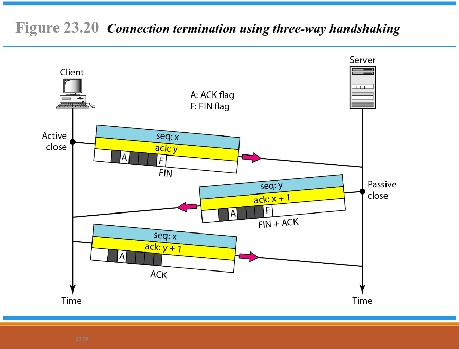

 # Tugas ADMIN JARINGAN

**Nama** : Vemas Satria Edy Pratama 
**Kelas** :2 D4 IT A / 3123600020 

## Tugas1. Analisa File http.cap dengan Wireshark

### 1. Versi HTTP

- Berdasarkan gambar di atas, versi HTTP yang digunakan adalah **HTTP/1.1**.
- Untuk mengetahui versi HTTP melalui Wireshark, pilih paket nomor 4, klik kanan dan pilih opsi **Follow** kemudian **HTTP streams**. Versi HTTP dapat dilihat pada bagian client dan server di bagian paling atas.

### 2. IP Address Client dan Server

- Berdasarkan gambar di atas, dapat diketahui bahwa *IP Address* dari client dan server adalah **145.254.160.237.** dan **65.208.228.223**. Untuk mengetahui **IP Address** dari client dan server dapat dilihat pada bagian **Source** dan **Destination**.

### 3. Waktu client mengirim HTTP request

- Pada gambar di atas, untuk mengetahui waktu dari client mengirimkan HTTP request dapat dilihat pada **packet nomor 4** dengan waktu **0.911310**.

### 4. Waktu server mengirim dan durasi

- Pada gambar di atas, dapat diketahui waktu server mengirimkan ke client adalah **3.955688** dengan melihat **packet nomor 27**, sehingga dapat diketahui waktu selisih server mengirimkan data client.

- Selisih waktu :
  `-> 3.955688 - 0.911310 = 3.044378`

- Jadi, selisih waktu server mengirimkan ke client adalah **3.044378**.

## Tugas2. Deskripsi Gambar pada Slide

Pada gambar di atas dapat dijelaskan bahwa:

1. **Node to Node (Data Link Layer)** 
  Pada tahap ini, komunikasi data terjadi antara dua perangkat fisik yang terhubung langsung dalam jaringan lokal (LAN). Data ditransmisikan dari satu node ke node lainnya melalui kabel atau koneksi nirkabel. Protokol yang bekerja pada lapisan ini meliputi Ethernet dan Wi-Fi. 
   - Fungsi utama: 
      - Mengatur bagaimana data dikirim dalam satu jaringan fisik. 
      - Menggunakan alamat MAC untuk mengidentifikasi perangkat. 
      - Menyediakan deteksi dan koreksi kesalahan pada transmisi data. 

2. **Host to Host (Network Layer)** 
  Ketika data perlu dikirim melampaui jaringan lokal, proses komunikasi antar host terjadi pada Network Layer. Protokol IP (Internet Protocol) digunakan untuk mengidentifikasi setiap perangkat yang terhubung dalam jaringan global. 
   - Fungsi utama: 
      - Menyediakan mekanisme routing agar paket data dapat mencapai tujuan akhir 
      - Menggunakan alamat IP sebagai identitas unik setiap perangkat. 
      - Menerapkan fragmentasi paket jika data terlalu besar untuk satu transmisi. 
  
  Proses ini melibatkan router yang meneruskan paket data dari satu jaringan ke jaringan lainnya. Setiap kali paket data berpindah dari satu router ke router lainnya, disebut sebagai Node to Node Communication. 

3. **Process to Process (Transport Layer)** 
   Setelah data mencapai perangkat tujuan, komunikasi harus diteruskan ke proses atau aplikasi yang sesuai. Lapisan Transport (Transport Layer) bertanggung jawab untuk memastikan data diterima oleh aplikasi yang benar. 
   - Fungsi utama: 
      - Menggunakan protokol seperti TCP (Transmission Control Protocol) dan UDP (User Datagram Protocol. 
      - TCP menyediakan komunikasi andal dengan mekanisme three-way handshake dan pengontrolan kesalahan. 
      - UDP memungkinkan pengiriman data yang cepat tanpa harus menunggu konfirmasi penerimaan.

## Tugas3. Rangkuman Tahapan Komunikasi Menggunakan TCP

### 1. Connection Establishment Using Three-Way Handshaking

Proses *three-way handshake* yang digunakan untuk membangun koneksi antara client dan server:

- **SYN (Synchronization Request)**  
  - Client menginisiasi koneksi dengan mengirim SYN (synchronize) ke server.
  - Client juga menyertakan sequence number awal (misalnya, seq: 8000).
  - Server dalam keadaan passive open, menunggu permintaan koneksi.

- **SYN-ACK (Synchronization Acknowledgment)**  
  - Server menerima permintaan dan membalas dengan SYN-ACK.
  - Server mengirim sequence number baru (misalnya, seq: 15000) dan mengakui nomor urut yang dikirim client (ack: 8001).

- **ACK (Acknowledgment)**  
  - Client mengonfirmasi koneksi dengan mengirim ACK.
  - Client menyertakan acknowledgment number yang sesuai dengan sequence number server + 1 (misalnya, ack: 15001).
  - Setelah tahap ini selesai, koneksi TCP telah berhasil dibuat, dan transfer data dapat dimulai.

Three-way handshake memastikan bahwa koneksi antara client dan server andalkan sebelum data ditransmisikan. Proses ini menghindari kehilangan paket dan menjamin komunikasi dua arah yang stabil dalam jaringan.

### 2. Data Transfer

Proses transfer data setelah koneksi berhasil dibangun:

- **Pengiriman Data Pertama**
  - Client mengirimkan data dengan sequence number 8001 dan acknowledgment 15001.
  - Data yang dikirim mencakup bytes 8001–9000.
  - A (ACK) dan P (PSH - Push flag) digunakan untuk memastikan data segera diproses oleh aplikasi di sisi penerima.

- **Pengiriman Data Kedua**
  - Client melanjutkan dengan mengirim sequence number 9001 dan acknowledgment tetap 15001.
  - Data yang dikirim mencakup bytes 9001–10000.
  - Server belum mengirim ACK tambahan karena data masih dalam proses.

- **Pengiriman Data oleh Server**
  - Server merespons dengan mengirim data balik menggunakan sequence number 15001 dan acknowledgment 10001.
  - Data yang dikirim mencakup bytes 15001–17000.
  - ACK dikirim bersamaan dengan data untuk efisiensi.

- **ACK Terakhir dari Client**
  - Client mengirimkan acknowledgment 17001 untuk memberi tahu server bahwa data hingga byte 17000 telah diterima.
  - Dikirim bersama dengan informasi receive window (rwnd: 10000) yang menunjukkan jumlah data yang bisa diterima client selanjutnya.

### 3. Connection Termination Using Three-Way Handshaking

Proses penghentian koneksi TCP menggunakan *three-way handshake* antara client dan server:

- **Client memulai penutupan koneksi (FIN)**  
  Client mengirimkan sinyal untuk memulai penutupan koneksi setelah transfer data selesai. Hal ini menunjukkan bahwa client tidak akan mengirim data lagi.

- **Server merespons dengan FIN + ACK**
  Server menerima permintaan terminasi dengan mengirimkan ACK (ack: x + 1). Server juga mengirimkan FIN dengan seq: y untuk menunjukkan bahwa akan siap untuk menutup koneksi.

- **Client mengirimkan ACK terakhir (ACK)**
  Client mengirimkan segmen ACK (ack: y + 1) sebagai konfirmasi bahwa telah menerima permintaan terminasi dari server dan setelah itu koneksi sepenuhnya tertutup.
