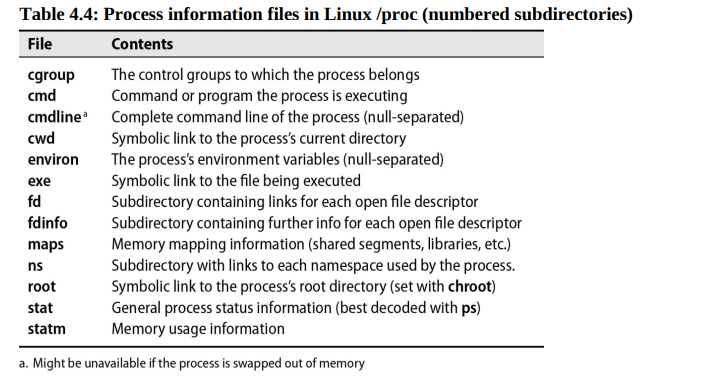
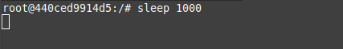
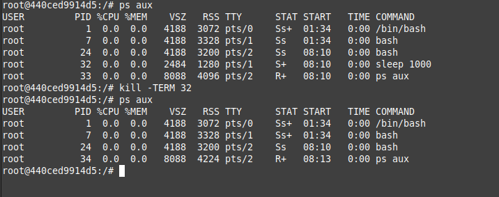
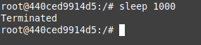
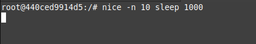
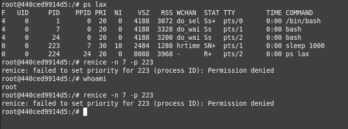
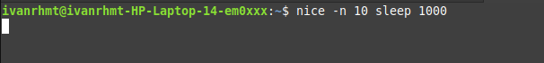
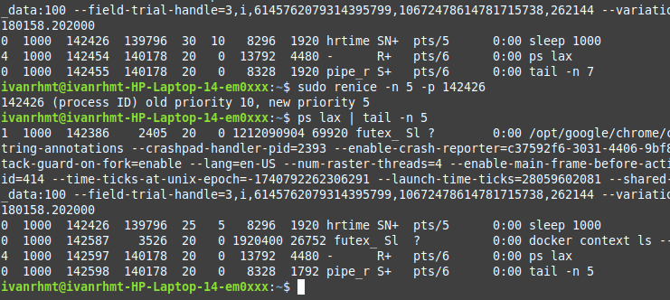

<h1 align="center">
  Chapter 4: Process Control
</h1>

<br>

Proses dalam sistem operasi terdiri dari dua komponen utama: address space (ruang memori untuk kode, data, dan stack) dan struktur data kernel (informasi seperti status, prioritas, dan sumber daya). Proses ini mengelola semua sumber daya yang diperlukan untuk menjalankan program, seperti memori, file yang dibuka, dan atribut lainnya. Proses dapat dianggap sebagai wadah yang mengelola semua sumber daya yang diperlukan untuk menjalankan sebuah program.

## Komponen dalam sebuah proses

1. **Thread**: Unit eksekusi dalam proses yang berbagi ruang memori dan sumber daya. Thread memungkinkan program untuk melakukan banyak tugas secara paralel. Karena lebih ringan dibandingkan proses, pembuatan dan penghapusan thread lebih efisien.
2. **PID (Process ID)**: Nomor unik yang diberikan oleh kernel untuk mengidentifikasi setiap proses. PID digunakan dalam berbagai operasi sistem, seperti mengirim sinyal atau memantau proses.
3. **Namespaces**: Fitur yang memungkinkan beberapa proses memiliki PID yang sama tetapi dalam lingkungan yang terisolasi. Ini digunakan dalam teknologi container, di mana setiap container memiliki lingkungannya sendiri yang terpisah.
4. **PPID (Parent Process ID)**: PID dari proses induk yang membuat proses tersebut. Setiap proses (kecuali proses utama sistem) memiliki proses induk, dan PPID membantu sistem melacak hubungan hierarkis antara proses.
5. **UID (User ID) dan EUID (Effective User ID)**: UID adalah ID pengguna yang menjalankan proses, sedangkan EUID adalah ID yang digunakan oleh proses untuk menentukan izin akses ke sumber daya seperti file, port jaringan, atau operasi sistem lainnya.

## Lifecycle suatu proses

Proses baru dibuat dengan system call fork, yang menyalin proses induk. Proses anak memiliki PID yang berbeda tetapi identik dengan proses induk. Pada Linux, fork sebenarnya memanggil clone, yang lebih canggih dan mendukung thread. Saat sistem boot, kernel membuat beberapa proses secara otomatis, termasuk init atau systemd (PID 1), yang bertanggung jawab menjalankan skrip startup. Semua proses lain adalah turunan dari proses utama ini.

### Signals

Signals adalah notifikasi yang dikirim ke proses untuk memberi tahu terjadinya suatu peristiwa. Ada sekitar 30 jenis signal, digunakan untuk berbagai tujuan seperti komunikasi antar proses, menghentikan proses, atau memberi tahu kondisi tertentu.


Beberapa signal penting termasuk:

- **KILL**: Menghentikan proses secara paksa (tidak bisa diabaikan).
- **INT**: Dikirim saat <CTRL-C> ditekan, meminta proses berhenti.
- **TERM**: Meminta proses berhenti dengan bersih.
- **HUP**: Biasanya digunakan untuk meminta daemon restart.
- **QUIT**: Mirip TERM, tetapi menghasilkan core dump jika tidak ditangani.

Perintah kill digunakan untuk mengirim signal ke proses. Secara default, kill mengirimkan signal TERM. Contoh:

```bash
kill -9 PID  # Menghentikan proses secara paksa
```

killall dan pkill adalah alternatif untuk menghentikan proses berdasarkan nama atau pengguna. Contoh:

```bash
killall firefox  # Menghentikan semua proses Firefox
pkill -u abdoufermat  # Menghentikan semua proses milik pengguna abdoufermat
```

## PS: memantau proses

Perintah ps adalah alat utama administrator sistem untuk memantau proses. ps dapat menampilkan PID, UID, prioritas, terminal kontrol, penggunaan memori, konsumsi CPU, dan status proses (seperti running, stopped, atau sleeping). Untuk mendapatkan gambaran umum sistem, jalankan ps aux.


Opsi lain yang berguna adalah lax, yang memberikan informasi teknis lebih rinci tentang proses. lax lebih cepat daripada aux karena tidak perlu mengurai nama pengguna dan grup.

top dan htop adalah alat pemantauan interaktif yang menampilkan proses secara real-time. htop menawarkan antarmuka yang lebih baik dan lebih banyak opsi untuk operasi.

## Nice and Renice: Mengubah Prioritas Proses

Niceness adalah nilai numerik yang memberikan petunjuk kepada kernel tentang bagaimana suatu proses harus diperlakukan relatif terhadap proses lain yang bersaing untuk mendapatkan CPU. Nilai niceness yang tinggi berarti prioritas proses rendah, sedangkan nilai rendah atau negatif berarti prioritas tinggi. Perintah nice digunakan untuk memulai proses dengan nilai niceness tertentu, sedangkan renice mengubah nilai niceness proses yang sedang berjalan. Contoh:

Contoh:

```bash
nice -n 10 sleep 1000  # Memulai proses dengan niceness 10
renice -n 5 -p PID     # Mengubah niceness proses menjadi 5
```

Priority value adalah nilai prioritas sebenarnya yang digunakan kernel Linux untuk menjadwalkan tugas. Di Linux, rentang prioritas adalah 0 hingga 139, di mana 0-99 untuk tugas real-time dan 100-139 untuk pengguna. Hubungan antara nilai nice dan priority adalah:

> priotiry_value = 20 + nice_value

Nilai nice default adalah 0. Semakin rendah nilai nice, semakin tinggi prioritas proses.

## The /proc Filesystem

Direktori /proc adalah pseudo-filesystem yang mengekspos informasi tentang status sistem dan proses. Setiap proses direpresentasikan oleh direktori dengan nama PID-nya. Tools seperti ps dan top membaca informasi status proses dari direktori /proc. /proc juga berisi informasi lain seperti statistik sistem.



## Strace and Truss

strace (Linux) dan truss (FreeBSD) digunakan untuk melacak system calls dan signals yang dilakukan oleh proses. Alat ini berguna untuk debugging program atau menganalisis perilaku suatu program. Contoh:

Contoh:

```bash
strace -p PID  # Melacak system calls proses tertentu
```

## Runaway processes

Proses yang tidak merespons sistem dan berjalan di luar kendali disebut runaway processes dan menggunakan 100% CPU disebut runaway processes. Untuk menghentikannya, gunakan perintah kill dengan sinyal KILL:

```bash
kill -9 pid

atau

kill -KILL pid
```

Alat seperti strace atau lsof dapat digunakan untuk menyelidiki penyebabnya. lsof menampilkan file yang dibuka oleh proses tersebut.

## Periodic Processes

### cron: menjadwalkan perintah

cron adalah alat tradisional untuk menjalankan perintah pada jadwal yang telah ditentukan. cron berjalan saat sistem boot dan terus beroperasi selama sistem aktif. cron membaca file konfigurasi (disebut crontab) yang berisi daftar perintah dan waktu eksekusinya. Perintah dijalankan menggunakan shell (sh), sehingga hampir semua perintah yang dapat dijalankan manual dapat dijadwalkan dengan cron.

File crontab disimpan di /var/spool/cron (Linux) atau /var/cron/tabs (FreeBSD). Format crontab terdiri dari lima field untuk menentukan menit, jam, hari, bulan, dan hari dalam minggu, diikuti oleh perintah yang akan dijalankan.

```bash
*     *     *     *     *  perintah yang akan dijalankan
-     -     -     -     -
|     |     |     |     |
|     |     |     |     +----- hari dalam seminggu (0 - 6) (Minggu=0)
|     |     |     +------- bulan (1 - 12)
|     |     +--------- tanggal (1 - 31)
|     +----------- jam (0 - 23)
+------------- menit (0 - 59)
```

Contoh:

```bash
30 2 * * * /path/to/command  # Menjalankan perintah setiap hari pukul 02:30
```

### crontab Management

Perintah crontab digunakan untuk mengelola crontab. Opsi -e untuk mengedit, -l untuk menampilkan, dan -r untuk menghapus crontab.

### Systemd Timer

Systemd timer adalah alternatif modern untuk cron. Timer diaktifkan oleh unit service dan dapat dijadwalkan berdasarkan waktu atau event tertentu. Contoh:

```bash
systemctl list-timers  # Menampilkan timer yang aktif
```

File konfigurasi timer (berakhiran .timer) menentukan jadwal dan akurasi eksekusi.

### Penggunaan umum untuk scheduled tasks

1. **Mengirim Email:**
   Menjadwalkan pengiriman email otomatis, seperti laporan harian atau hasil eksekusi perintah. Contoh:

```bash
30 4 25 * * /usr/bin/mail -s "Monthly report"
    abdou@admin.com%Receive the monthly report for the month of July!%%Sincerely,%cron%
```

2. **Membersihkan Filesystem:**
   Menjalankan script untuk menghapus file lama, seperti file di direktori trash. Contoh:

```bash
0 0 * * * /usr/bin/find /home/abdou/.local/share/Trash/files -mtime +30 -exec /bin/rm -f {} \;
```

3. **Rotasi Log File:**
   Memecah file log menjadi segmen berdasarkan ukuran atau tanggal untuk mempertahankan versi lama.

4. **Menjalankan Batch Jobs:**
   Menjadwalkan tugas panjang seperti pemrosesan pesan antrian atau ETL (Extract, Transform, Load).

5. **Backup dan Mirroring:**
   Menjadwalkan backup atau sinkronisasi direktori ke sistem remote menggunakan rsync.

## Percobann

### Mengirim sinyal ke proses



Menjalankan sebuah proses `sleep 1000`.



Memantau proses menggunakan `ps aux` dan mengirim sinyal TERM pada proses dengan PID `32` menggunakan `kill`.



Proses dengan PID `32` berhasil dihentikan dengan bersih.

### Mengubah Prioritas Proses dengan nice dan renice



Menjalankan sebuah proses `sleep 1000` dengan nilai niceness `10`.



Memantau proses menggunakan `ps aux`. Proses yang baru saya jalankan adalah proses dengan PID `223` dan nilai niceness `10`. Nilai niceness yang lebih tinggi ini menunjukkan bahwa proses tersebut memiliki prioritas yang lebih rendah dibandingkan proses lainnya (angka yang lebih besar menunjukkan prioritas yang lebih rendah).

Namun, ketika saya mencoba mengubah nilai niceness menggunakan `renice`, saya mendapatkan pesan error `Permission denied`. Mungkin hal ini terjadi karena menggunakan docker. Meskipun login sebagai root, Docker menggunakan namespace isolation dan cgroups yang membatasi akses penuh ke sistem, mungkin termasuk kemampuan untuk mengubah Niceness proses. Oleh karena itu, saya mencoba melakukan renice di terminal sistem operasi yang saya gunakan yaitu Linux mint.




Pada proses dengan PID `142426` awalnya memiliki nilai niceness `10` dan memiliki nilai prioritas `30`. Ketika melakukan `renice` dengan mengubah nilai niceness menjadi `5` nilai prioritasnya juga berubah menjadi `25`. Nilai prioritas akan naik sebanyak turunnya nilai niceness.
