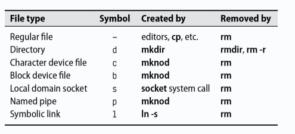

<h1 align="center">
  Chapter 5: Filesystem
</h1>

<br>


Filesystem bertujuan untuk mengatur dan merepresentasikan sumber daya penyimpanan sistem. Terdiri dari empat komponen utama: namespace, API, security models, dan implementation. Filesystem yang umum digunakan antara lain ext4, XFS, UFS, ZFS, dan Btrfs. Filesystem asing seperti FAT, NTFS, dan ISO 9660 juga digunakan.

## Pathnames

Pathname adalah string yang menunjukkan lokasi file dalam hierarki filesystem. Pathname bisa bersifat absolute (contoh: `/home/username/file.txt`) atau relative (contoh: `./file.txt`). Istilah "folder" sebaiknya dihindari dalam konteks teknis, gunakan "directory".

## Filesystem mounting and unmounting

Filesystem di-attach ke pohon direktori dengan perintah mount. Mount point adalah direktori yang menjadi titik attachment filesystem baru. Contoh:

```bash
mount /dev/sda4 /users
```

Unmounting bisa dilakukan dengan umount. Opsi umount -l untuk lazy unmount dan umount -f untuk forceful unmount. Untuk mengetahui proses yang menggunakan filesystem, gunakan lsof atau fuser.

## Organisasi dari file tree

Struktur file tree di sistem UNIX tidak terorganisir dengan baik. Beberapa direktori penting termasuk /boot (kernel), /etc (file konfigurasi), /bin dan /sbin (utilitas sistem), /tmp (file sementara), /dev (file perangkat), /usr (program dan library), dan /var (file yang sering berubah seperti log).


## Tipe file

Filesystem mendefinisikan tujuh jenis file:

1. **Regular files**: File biasa seperti teks, data, atau program.
2. **Directories**: Referensi ke file lain.
3. **Character device files**: Untuk perangkat karakter seperti terminal.
4. **Block device files**: Untuk perangkat blok seperti disk.
5. **Local domain sockets**: Untuk komunikasi antar proses.
6. **Named pipes (FIFOs)**: Untuk komunikasi antar proses.
7. **Symbolic links**: Referensi ke file atau direktori lain.



## Atribut file

Setiap file memiliki permission bits yang menentukan siapa yang bisa membaca, menulis, dan mengeksekusi file. Permission bits dibagi menjadi tiga grup: owner, group, dan others. Selain itu, ada setuid, setgid, dan sticky bit yang memengaruhi eksekusi file dan direktori.


### Permission Bits

Permission bits bisa diatur dengan perintah chmod menggunakan notasi oktal atau simbolik. Contoh:

```bash
chmod u+w file.txt  # Menambahkan write permission untuk owner
chmod 755 file.txt  # Mengatur permission menjadi rwxr-xr-x
```

### setuid dan setgid Bits

Bit setuid dan setgid memungkinkan file dijalankan dengan hak akses owner atau group file tersebut. Pada direktori, setgid menyebabkan file baru memiliki group yang sama dengan direktori.

### Sticky Bit

Bit setuid dan setgid memungkinkan file dijalankan dengan hak akses owner atau group file tersebut. Pada direktori, setgid menyebabkan file baru memiliki group yang sama dengan direktori.

### ls, chmod, chown, chgrp, dan umask

- **ls**: Menampilkan daftar file dan direktori.
- **chmod**: Mengubah permission file.
- **chown**: Mengubah owner dan group file.
- **chgrp**: Mengubah group file.
- **umask**: Menentukan permission default untuk file dan direktori baru.

## Access Control Lists (ACLs)

ACLs memperluas model permission tradisional dengan memungkinkan multiple owner dan permission yang lebih fleksibel. Ada dua jenis ACL: POSIX ACLs dan NFSv4 ACLs.

### POSIX ACLs

POSIX ACLs adalah ACL tradisional yang didukung oleh banyak sistem Unix-like. Contoh penggunaan:

```bash
setfacl -m user:abdou:rwx,group:users:rwx,other::r /home/abdou
```

### NFSv4 ACLs

NFSv4 ACLs lebih canggih dan memiliki fitur seperti default ACL untuk file dan direktori baru. Contoh:

```bash
nfs4_setfacl -a A::abdou@example.com:RW /home/abdou
```

Dengan ACL, pengaturan hak akses menjadi lebih fleksibel dan powerful, memungkinkan kontrol yang lebih detail terhadap file dan direktori.
